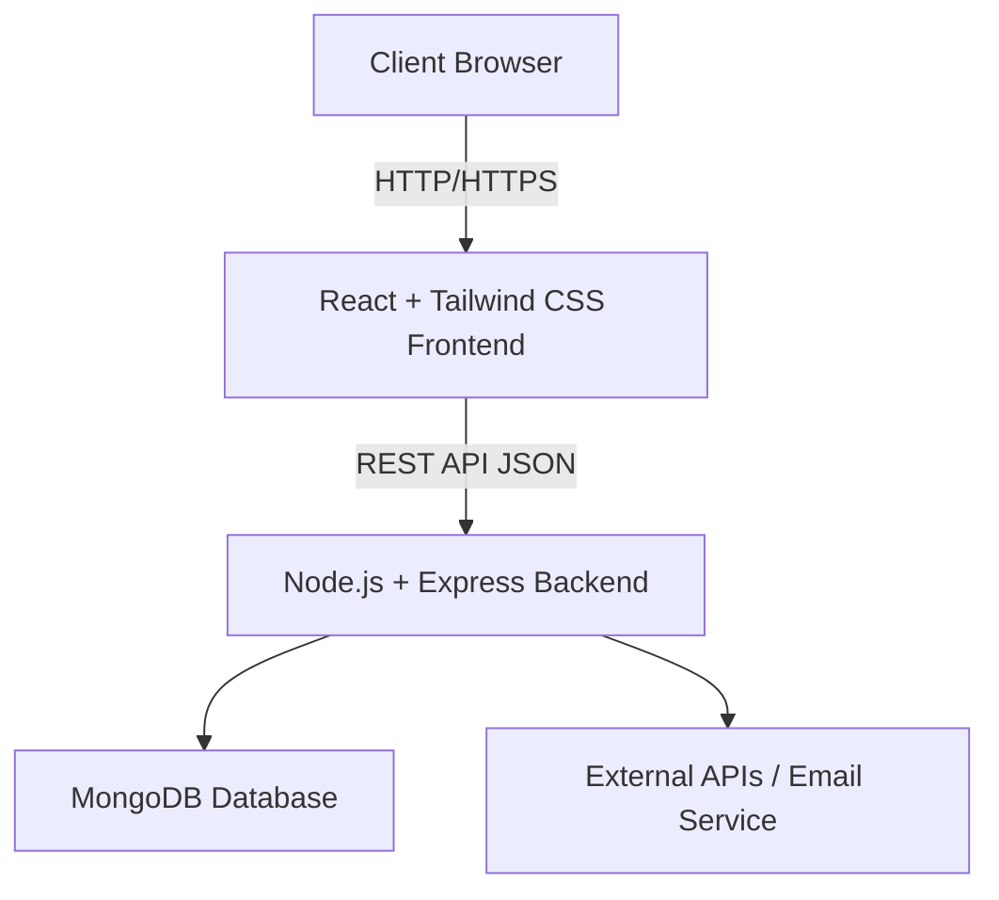
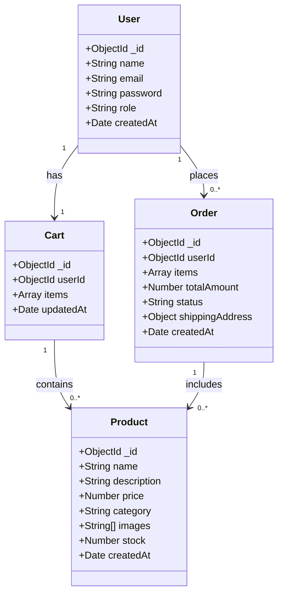
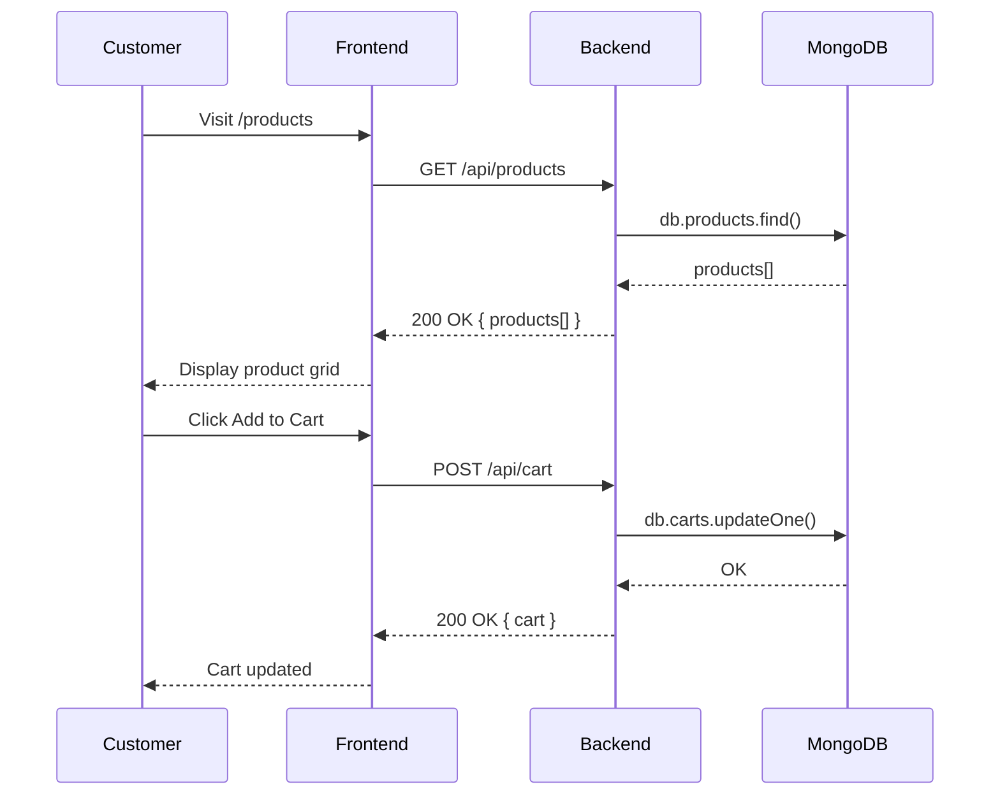
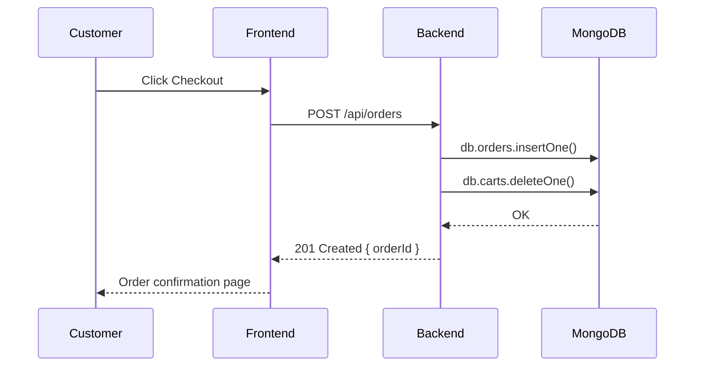
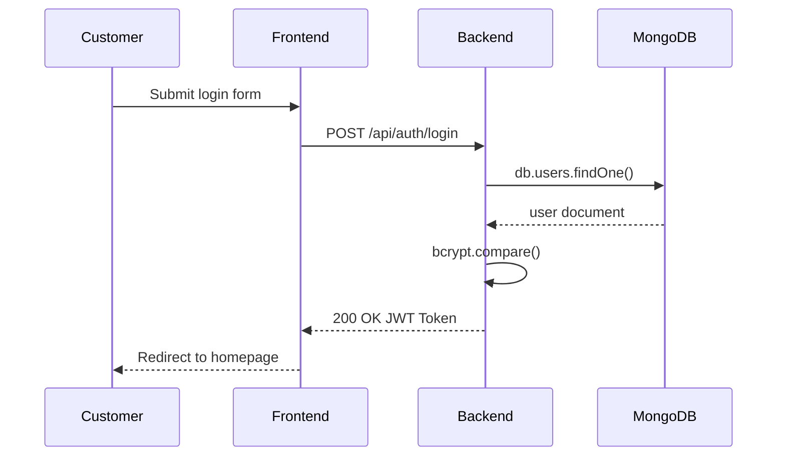

# Stage 3: Technical Documentation

## E-Commerce Web Platform — MVP

---

## 1. User Stories and Mockups

### User Stories (MoSCoW Prioritization)

#### Must Have
- As a **customer**, I want to **browse a product catalog**, so that I can **discover available items**.
- As a **customer**, I want to **view product details** (name, description, price, images), so that I can **make an informed purchase decision**.
- As a **customer**, I want to **add products to my cart**, so that I can **group items before purchasing**.
- As a **customer**, I want to **place an order**, so that I can **buy the products I selected**.
- As a **customer**, I want to **use the platform on mobile and desktop**, so that I can **shop from any device**.

#### Should Have
- As a **customer**, I want to **create an account and log in**, so that I can **access my order history**.
- As a **customer**, I want to **search and filter products**, so that I can **find items faster**.

#### Could Have
- As a **customer**, I want to **receive an email confirmation after ordering**, so that I can **have proof of my purchase**.
- As an **admin**, I want to **manage the product catalog** (add/edit/delete), so that I can **keep the store up to date**.

#### Won't Have (MVP Scope)
- Payment gateway integration (Stripe, PayPal) — planned for post-MVP.
- User reviews and ratings.
- Advanced analytics dashboard.

### Mockups
Mockups cover the following main screens: Home / Product listing page, Product detail page, Shopping cart, Checkout form, and Order confirmation.
*(Mockups to be created in Figma and linked [here](https://www.figma.com/make/JfqHiZO5yiv7yXjKSzJ1QJ/E-commerce-Platform-UI-UX-Mockup?t=71piz1L9V7iX2WYE-20&fullscreen=1.) )*

---

## 2. System Architecture

### High-Level Architecture

### Data Flow
- The **React frontend** makes HTTP requests to the **Express REST API**.
- The **Express backend** processes requests, applies business logic, and queries **MongoDB**.
- MongoDB stores **products, users, carts, and orders** as document collections.
- Static assets are served by the frontend build.

---

## 3. Components, Classes, and Database Design

## 4. High-Level Sequence Diagrams

### Scenario 1: Customer browses and adds a product to cart

### Scenario 2: Customer places an order

### Scenario 3: User logs in

---

## 5. API Specifications

### External APIs
| API | Purpose | Justification |
|-----|---------|---------------|
| None required at MVP | — | The MVP focuses on core e-commerce features without third-party dependencies to reduce complexity. Email confirmation is a Could-Have feature for post-MVP. |

### Internal API Endpoints

#### Authentication
| Method | Endpoint | Input | Output |
|--------|----------|-------|--------|
| POST | /api/auth/register | `{ name, email, password }` | `{ token, user }` |
| POST | /api/auth/login | `{ email, password }` | `{ token, user }` |

#### Products
| Method | Endpoint | Input | Output |
|--------|----------|-------|--------|
| GET | /api/products | query: `?category=&search=` | `{ products[] }` |
| GET | /api/products/:id | — | `{ product }` |
| POST | /api/products | (admin) `{ name, description, price, category, images, stock }` | `{ product }` |
| PUT | /api/products/:id | (admin) fields to update | `{ product }` |
| DELETE | /api/products/:id | (admin) — | `{ message }` |

#### Cart
| Method | Endpoint | Input | Output |
|--------|----------|-------|--------|
| GET | /api/cart | (auth required) — | `{ cart }` |
| POST | /api/cart | `{ productId, quantity }` | `{ cart }` |
| DELETE | /api/cart/:productId | — | `{ cart }` |

#### Orders
| Method | Endpoint | Input | Output |
|--------|----------|-------|--------|
| POST | /api/orders | `{ items[], shippingAddress }` | `{ order }` |
| GET | /api/orders | (auth) — | `{ orders[] }` |
| GET | /api/orders/:id | (auth) — | `{ order }` |

---

## 6. SCM and QA Strategies

### Source Control Management (Git)

**Branching Strategy:**
- `main` — stable, production-ready code only
- `develop` — integration branch for all features
- `feature/<feature-name>` — one branch per feature (e.g., `feature/product-listing`)
- `fix/<bug-name>` — hotfix branches

**Workflow:**
1. Create a `feature/` branch from `develop`.
2. Develop and commit regularly with clear messages (e.g., `feat: add product listing endpoint`).
3. Open a Pull Request to `develop`.
4. Code review by the other team member before merging.
5. Merge to `main` only after full testing of `develop`.

**Commit Convention:** `type: short description` (types: feat, fix, docs, style, refactor, test)

### Quality Assurance (QA)

**Testing Strategy:**

| Type | Scope | Tool |
|------|-------|------|
| Unit Tests | Backend functions and route handlers | Jest |
| Integration Tests | API endpoint responses (status codes, data) | Jest + Supertest |
| Manual Tests | UI flows (browse, cart, checkout) | Browser (Chrome DevTools) |

**Test Plan:**
- All CRUD endpoints must have at least one success test and one error test.
- Cart and Order flows must be tested end-to-end.
- Frontend tested manually on Chrome (desktop) and mobile viewport.

**Deployment Pipeline:**
- Development: local environment (`localhost:3000` frontend, `localhost:5000` backend)
- Staging: GitHub Codespaces / Render free tier
- Production: TBD (post-MVP)

---

## 7. Technical Justifications

| Choice | Justification |
|--------|---------------|
| **React** | Component-based architecture fits a product catalog with reusable cards. Large ecosystem, well-known by the team. |
| **Tailwind CSS** | Utility-first CSS enables rapid UI development without custom stylesheets. Responsive design out of the box. |
| **Node.js + Express** | Lightweight and fast REST API server. JavaScript across the full stack reduces context switching for a 2-person team. |
| **MongoDB** | Document-oriented model fits product data with variable attributes (images, categories). Flexible schema for MVP iteration. No need for rigid relational structure at this stage. |
| **JWT Authentication** | Stateless authentication suits a REST API. No session management needed on the server side. |
| **Jest + Supertest** | Standard testing tools for Node.js/Express. Easy integration, widely documented. |
| **Git Flow (main/develop/feature)** | Keeps main always deployable. Feature isolation reduces merge conflicts in a 2-person team. |

---

*Document produced by Lucas Mettal and Teammate — Holberton Toulouse, Stage 3.*
